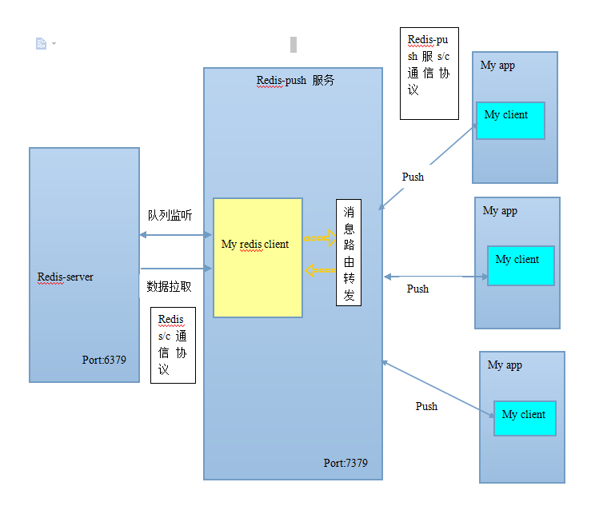

# redis-push

通过redis s/c 通信协议与redis server进行通信

## redis-push 服务框架设计图
 
 
 
##初步单机测试结果

####测试环境：  

  主机：mac pro  

  处理器：2.2 GHz Intel Core i7  

  内存:16 GB 1600 MHz DDR3  

  redis服务和redis-push服务，应用都在单机上，拉取110万数据分发到各个应用总耗时30秒左右，每条数据10个字节  
  

##说明
 项目开发中……